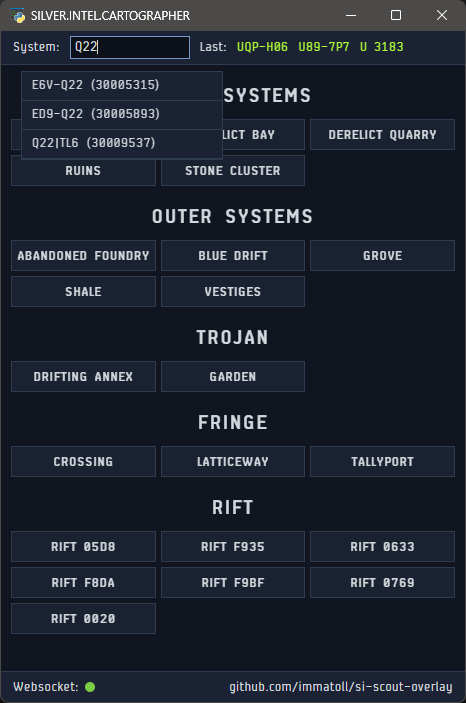

# Frontier Chat Location Parser + WebSocket Server

A Python tool that watches your **Frontier chat logs** for system location changes and broadcasts the current location over a WebSocket server in real time.

<p align="center">
  
</p>

---

## Features

### Chat log Reader: 
- Monitors the latest `Local_*.txt` chat log file (Windows: "%USERPROFILE%\Documents\Frontier\logs\Chatlogs")
- Detects when the player changes local system channels.
- Automatically detects log file encoding (`UTF-8`, `UTF-16`, `UTF-16-BE`, `UTF-8-SIG`).

### Websocket (Server): 
- Broadcasts the current system name and system ID to connected WebSocket clients (e.g. www.silver-tribe.com/scout)
- Websocket server runs via `ws://localhost:9001`

### Webviewer Overlay: 
- Simple Webviewer Overlay (Mini-Browser)
- Default-URL: `https://www.silver-tribe.com/scout`*
- Default-Settings: `width=480, height=710, frameless=False, on_top=True`

*Note: Websocket Server <> Client communication runs locally within the browser (Python <> JavaScript).

---

## Requirements

- Python 3.10+
- Windows (or modify the chatlog path manually)
- [websockets](https://pypi.org/project/websockets/)
- Optional: [pywebview](https://pypi.org/project/pywebview/) if you want to display the data in a simple GUI overlay.

## Install dependencies:

```bash
pip install websockets pywebview
```
or
```bash
pip install -r requirements.txt
```

---

## Requirements

Run overlay, websocket and chat log parser:
```bash
python launcher.py (for Websocket + Webviewer)
```

Run websocket and chat log parser only::
```bash
python apps/locator.py (for Websocket only)
```

Run overlay only:
```bash
python apps/overlay.py 
```